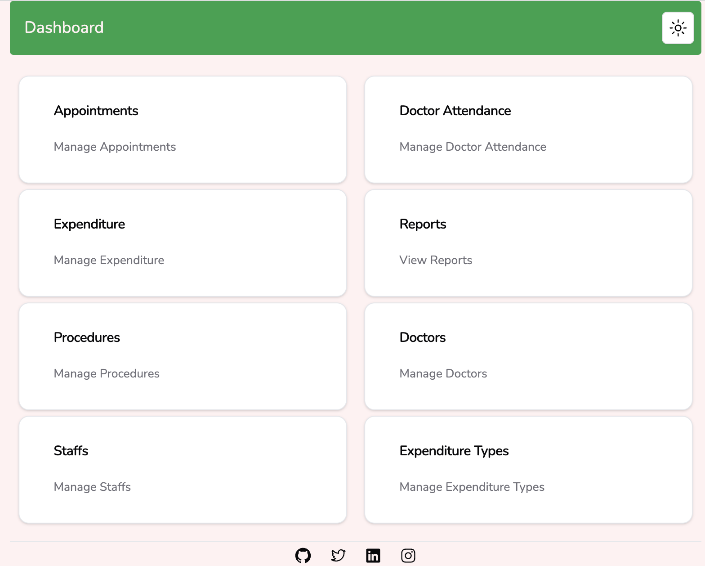
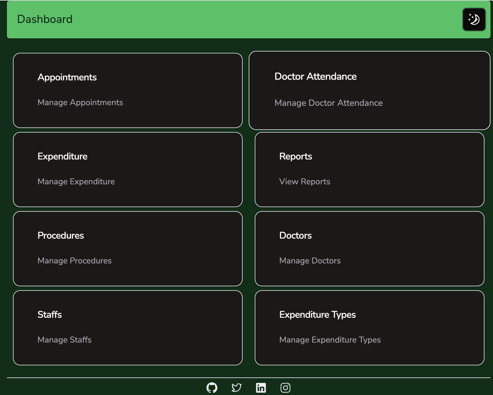

# Next13 Medkit
Medical Reception App made using next13 app dir, tailwindcss, shadcn-ui, mongodb, prisma, uploadthing and firebase mobile authentication

Demo :- [https://next13-medkit.vercel.app/](https://next13-medkit.vercel.app/)

License :- [Apache-2.0](./LICENSE)

## Screenshots

> [Youtube Video Demo](https://youtu.be/sYs7NJXhrjY)

> Lightmode Dashboard
> 

> Darkmode Dashboard
> 

## Tech Stack
1. Next13 App Directory
2. Prisma with MongoDB
3. Firebase Mobile Auth
4. Yup and Zod for form and input validation
5. Uploadthing for file uploads
6. Tailwindcss and shadcn-ui for styling
7. Next Themes for theme switching

## Features
1. Mobile OTP Auth for Staffs
2. Manage Procedures,Doctors their schedules, Staffs and Expediture Types
3. Add New expenditures and appointments and query them by date
4. Add Bill items for appointments
5. Enable Part Payment for appointments to allow payments in installments
6. Add Test reports for appointments
7. Add Supporting documents for expenditures
8. Get reports of expenditures, Share of each doctor and total income along with stakeholders in the selected date range

## Get Started
1. Rename `env.sample` to `env-*.local` or `.env`
2. Replace the following variables to correct values

```shell
	DATABASE_URL="YOUR_MONGODB_URL"
	AUTH_SECRET="YOUR_RANDOM_AUTH_SECRET"
	NEXT_PUBLIC_FIREBASE_API_KEY="YOUR_FIREBASE_API_KEY"
	NEXT_PUBLIC_FIREBASE_AUTH_DOMAIN="YOUR_FIREBASE_AUTH_DOMAIN"
	NEXT_PUBLIC_FIREBASE_PROJECT_ID="YOUR_FIREBASE_PROJECT_ID"
	NEXT_PUBLIC_FIREBASE_STORAGE_BUCKET="YOUR_FIREBASE_STORAGE_BUCKET"
	NEXT_PUBLIC_FIREBASE_MESSAGING_SENDER_ID="YOUR_FIREBASE_MESSAGING_SENDER_ID"
	NEXT_PUBLIC_FIREBASE_APP_ID="YOUR_FIREBASE_APP_ID"
	NEXT_PUBLIC_FIREBASE_MEASUREMENT_ID="YOUR_FIREBASE_MEASUREMENT_ID"
	UPLOADTHING_SECRET="YOUR_UPLOADTHING_SECRET"
	UPLOADTHING_APP_ID="YOUR_UPLOADTHING_APP_ID"
```
3. Start development Server

```shell
 yarn dev
```
Feel free to test the application and send PRs for improvement and report issues

P.S. - All PRs will be considered from `dev` branch and PRs from `main` will be ignored
